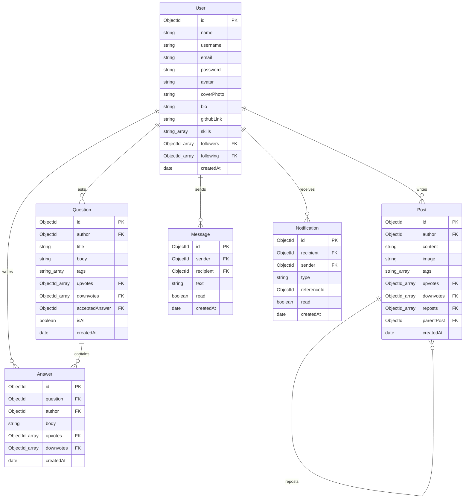

# DevCircle

DevCircle is a community platform built specifically for developers to share insights, ask questions, follow peers, and engage in real-time conversations. Powered by AI for content enhancements and validation.

---

## Key Features

* **Interactive Feed**: Share posts with code blocks, upvote/downvote content, repost, and comment with infinite scroll pagination.
* **Q&A Section**: Stack Overflow-inspired technical question board featuring sorting options, accepted answer selections, and hot-topic tag lists.
* **Real-time Messaging**: Full 1-on-1 private messaging channel with online indicators and unread indicators powered by WebSockets.
* **Live Notifications**: Real-time push alerts for user actions (likes, comments, answers, follows) utilizing active socket channels.
* **AI Assistant Integration**: Improve draft posts, rewrite confusing questions, and check question vagueness before publishing using Google Gemini AI models.
* **Global Unified Search**: Instantly query across users, posts, or Q&A threads in a single consolidated search window.
* **Developer Profiles**: Customize cover art, display skills, link GitHub accounts, and track historical contributions using a visual activity contribution calendar heatmap.

---

## Architecture Choices

* **Client-Server Separation**: A modern split structure consisting of a lightweight React SPA frontend and an Express REST API backend.
* **Redux Toolkit State Management**: Centralized slice architecture (auth, posts, Q&A, notifications) to maintain client-side consistency.
* **Real-time Engine**: Built with WebSockets (Socket.io) to support instant direct messaging and instant notifications (likes, follows, answers) bypassing standard HTTP overhead.
* **Backend MVC Structure**: Separated into controllers (request handlers), services (business and external integrations like Gemini), config (database mappings), and models (Mongoose schemas) to maintain clean separation of concerns.
* **Custom React Hooks Hooking**: Custom hooks (like `useLogout` and `useScrollToTop`) decouple side-effect bindings from presentation layout views to follow DRY principles.
* **Lightweight Security Middlewares**:
  * Custom in-memory map rate limiter to throttle API abuse (bypassed in development mode).
  * Helmet to set secure HTTP headers.
  * Express Mongo Sanitize to prevent query injection attacks.

---

## Database Schema (ERD)



---

## Technology Stack

### Frontend
* **Core**: React 18 + Vite
* **State Management**: Redux Toolkit
* **Styling**: Tailwind CSS
* **Real-time**: Socket.io Client
* **Libraries**: React Router DOM (v6), Axios, Date-fns, React Hot Toast

### Backend
* **Runtime**: Node.js + Express
* **Database**: MongoDB (via Mongoose)
* **Real-time**: Socket.io Server
* **Authentication**: JWT (Access + Refresh tokens with HttpOnly cookies)
* **AI Engine**: Google Gemini API integrations

---

## Repository Structure

```
├── frontend/             # React Client
│   ├── src/
│   │   ├── app/          # Redux Store Configuration
│   │   ├── components/   # Shared components (Sidebar, PostCard, modals)
│   │   ├── features/     # Redux Toolkit Slices (auth, posts, QA)
│   │   ├── pages/        # Route page views (Feed, Messages, Profile)
│   │   ├── services/     # API Axios client services
│   │   └── socket/       # Socket.io connection logic
│   └── index.html
│
└── backend/              # Express API Server
    ├── src/
    │   ├── config/       # DB & app configs
    │   ├── controllers/  # Route controller handlers
    │   ├── middlewares/  # Authentication, validation, error handlers
    │   ├── models/       # Mongoose database models
    │   ├── routes/       # Express router mappings
    │   ├── services/     # AI & Socket handler services
    │   └── server.js     # Entry point
```

---

## Project Setup

### Prerequisites
* [Node.js](https://nodejs.org/) installed
* [MongoDB](https://www.mongodb.com/) running locally or a MongoDB Atlas URI

### Installation

1. **Clone the repository**:
   ```bash
   git clone <repo-url>
   cd new
   ```

2. **Backend Setup**:
   * Navigate to the backend folder:
     ```bash
     cd backend
     ```
   * Install dependencies:
     ```bash
     npm install
     ```
   * Create a `.env` file:
     ```env
     PORT=5000
     MONGO_URI=mongodb://localhost:27017/devcircle
     JWT_SECRET=jwt_secret
     JWT_REFRESH_SECRET=jwt_refresh_secret
     JWT_EXPIRES_IN=15m
     JWT_REFRESH_EXPIRES_IN=7d
     CLOUDINARY_CLOUD_NAME=cloud_name
     CLOUDINARY_API_KEY=api_key
     CLOUDINARY_API_SECRET=api_secret
     AI_PROVIDER=openai
     OPENAI_API_KEY=openai-key
     CLIENT_URL=http://localhost:5173
     NODE_ENV=development
     ```
   * Start the dev server:
     ```bash
     npm run dev
     ```

3. **Frontend Setup**:
   * Navigate to the frontend folder:
     ```bash
     cd ../frontend
     ```
   * Install dependencies:
     ```bash
     npm install
     ```
   * Create a `.env` file:
     ```env
     VITE_API_URL=http://localhost:5000/api
     VITE_SOCKET_URL=http://localhost:5000
     ```
   * Start the client dev server:
     ```bash
     npm run dev
     ```

---

## Sample API Calls

You can import the fully-configured Postman Collection file directly from the root directory:
**[devcircle_postman_collection.json](file:///d:/Learning/new/devcircle_postman_collection.json)**

Here are some raw examples of the API:

### 1. Register User
`POST /api/auth/register`
```bash
curl -X POST http://localhost:5000/api/auth/register \
  -H "Content-Type: application/json" \
  -d '{
    "name": "John Doe",
    "username": "johndoe",
    "email": "johndoe@example.com",
    "password": "securepassword123"
  }'
```

### 2. Login User
`POST /api/auth/login`
```bash
curl -X POST http://localhost:5000/api/auth/login \
  -H "Content-Type: application/json" \
  -d '{
    "email": "johndoe@example.com",
    "password": "securepassword123"
  }'
```

### 3. Get Posts Feed
`GET /api/posts?page=1&limit=10`
```bash
curl -X GET "http://localhost:5000/api/posts?page=1&limit=10" \
  -H "Authorization: Bearer <your_jwt_access_token>"
```

### 4. Improve Draft Post Content using Gemini AI
`POST /api/ai/improve-post`
```bash
curl -X POST http://localhost:5000/api/ai/improve-post \
  -H "Authorization: Bearer <your_jwt_access_token>" \
  -H "Content-Type: application/json" \
  -d '{
    "content": "write draft post about state management in react"
  }'
```
---